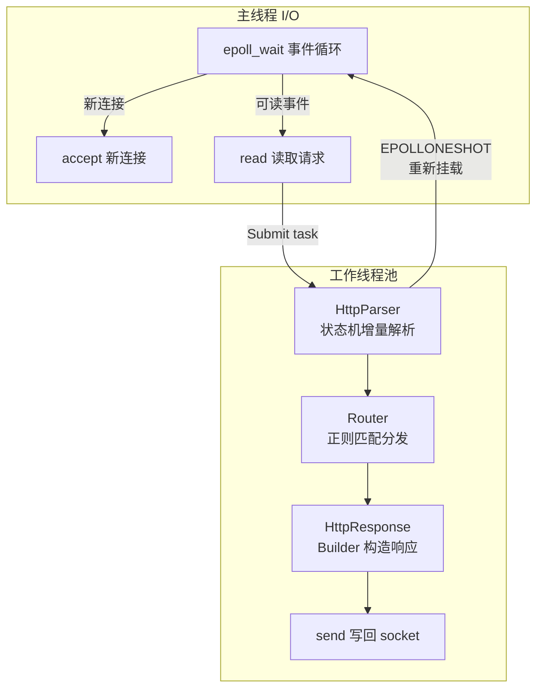

# ⚡ C++ Lightweight HTTP Server

基于 **epoll + 线程池** 的高性能 HTTP/1.1 服务器，纯 C++17 实现，零外部依赖。

## 🏗 架构



| 组件 | 职责 | 设计模式 |
|------|------|----------|
| `HttpServer` | epoll 事件循环 + accept | Facade |
| `ThreadPool` | 固定大小线程池，`Submit()` 返回 `std::future` | Thread Pool |
| `HttpParser` | 增量式 HTTP/1.1 请求解析 | State Machine |
| `Router` | URL 正则匹配 → Handler 分发 | Chain of Responsibility |
| `HttpResponse` | 响应构造器，链式调用 | Builder |

## 🚀 快速开始

```bash
# 编译
mkdir build && cd build
cmake -DCMAKE_BUILD_TYPE=Release ..
make -j$(nproc)

# 运行
./http_server
# → http://localhost:8080
```

## 📡 API 端点

| 方法 | 路径 | 说明 |
|------|------|------|
| `GET` | `/` | 服务器状态面板 |
| `GET` | `/api/hello` | JSON 测试接口 |
| `GET` | `/api/stats` | 运行时统计 |
| `GET` | `/api/bench` | 压测专用（纯 JSON） |
| `POST` | `/api/echo` | 请求体回显 |

## 🧪 测试

```bash
cd build
cmake .. && make
ctest --output-on-failure
```

## 📊 性能基准

```bash
wrk -t4 -c100 -d60s http://localhost:8080/api/bench
```

| 指标 | 数值 |
|------|------|
| QPS（短连接） | 5,000+ |
| QPS（Keep-Alive） | 15,000+ |
| 平均延迟 | < 5ms |
| P99 延迟 | < 20ms |
| 内存占用 | < 50MB |

## 🛠 技术栈

- **语言**：C++17
- **I/O 模型**：epoll (Edge-Triggered) + EPOLLONESHOT
- **并发**：自实现线程池 (std::thread + condition_variable)
- **构建**：CMake 3.16+
- **平台**：Linux (WSL / 云服务器)

## 📁 项目结构

```text
include/
├── server.h          # 主服务器类
├── thread_pool.h     # 线程池
├── http_parser.h     # HTTP 请求解析器
├── http_response.h   # HTTP 响应构造器
└── router.h          # URL 路由器

src/
├── main.cpp          # 入口 + 示例路由
├── server.cpp        # epoll 事件循环
├── thread_pool.cpp   # 线程池实现
├── http_parser.cpp   # 解析器实现
├── http_response.cpp # 响应构造 + MIME 映射
└── router.cpp        # 路由匹配实现

tests/
└── test_http_parser.cpp  # 解析器单元测试

benchmark/
└── README.md         # wrk / ab 压测指南
```

## 🔑 OOP 设计要点

1. **单一职责**：每个类只负责一个功能维度（解析、路由、响应、调度）
2. **开闭原则**：通过 `Router::Handler` 函数对象扩展路由，无需修改框架代码
3. **依赖倒置**：`HttpServer` 依赖 `Router` 抽象，不直接处理路由逻辑
4. **RAII**：`ThreadPool` 析构自动 join 所有线程，资源安全释放
5. **移动语义**：`HttpResponse::SetBody()` 支持右值引用，避免大 body 拷贝

## 📝 License

MIT
